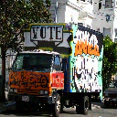

# PyTorch-Deep-Steganography-Using-Fourier-Transform

## Usage
```
main.py [-h] [-use | -train] [-encode | -decode] [--datapath]
              [--num_train] [--num_val] [--size] [--bs] [--epochs] [--model]
              [--fourierSeed]
```

#### Optional Args
```
  -h, --help      show this help message and exit
  -use            Use for Inference
  -train          Train a new model
  -encode         Use encoder to encode secret image in cover image
  -decode         Use decoder to decode secret image from cover image
  --datapath      Path to Dataset folder
  --num_train     Number of training pairs to be created
  --num_val       Number of validation pairs to be created
  --size          Size of the images
  --bs            Batch Size
  --epochs        Number of Epochs
  --model         Path for the model file if you want to finetune
  --fourierSeed   Seed for generating the pseudorandom matrix for changing
                  phase in fourier domain
```
### Tiny Deviations 
* deviation between cover and contianer 
  <table align='center'>
  <tr align='center'>
  <td> cover image </td>
  <td> container image </td>
  </tr>
  <tr>
  <td>
  <td>
  </tr>
  </table>


* deviation between secret and revealed secret 
  <table align='center'>
  <tr align='center'>
  <td> secret image </td>
  <td> revealed secret image </td>
  </tr>
  <tr>
  <td>
  <td>
  </tr>
  </table>